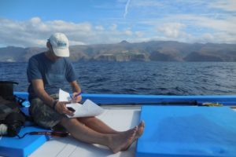
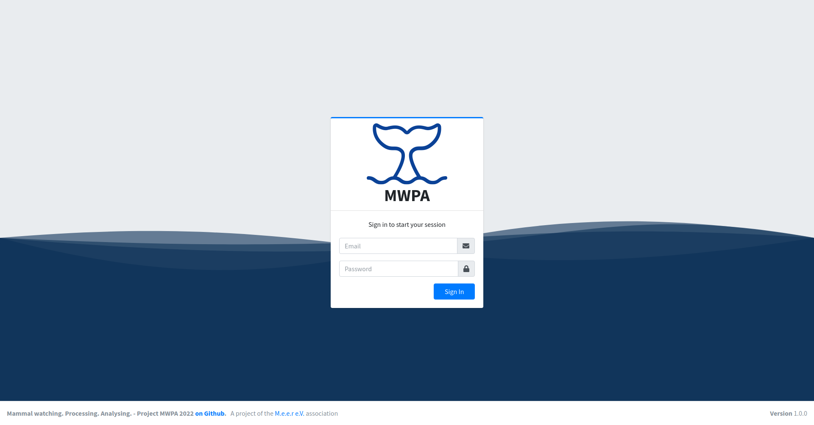

<p align="center">NOTE: This document is under development. Please check regularly for updates!</p>

<h1 align="center">


MWPA

</h1>

<p align="center">Mammal watching. Processing. Analysing.</p>
<p align="center">Processing and analysing data gathered by mammal watching.</p>
<div align="center">

[](https://gitter.im/Mammals-watchig-process-analyse/Main?utm_source=badge&utm_medium=badge&utm_campaign=pr-badge)
[](https://lgtm.com/projects/g/stefanwerfling/mwpa)
[](https://lgtm.com/projects/g/stefanwerfling/mwpa)
[](https://www.gnu.org/licenses/gpl-3.0)
[](https://liberapay.com/StefanWerf/donate)
</div>

MWPA provides the acquisition of scientific observational data, an easy-to-use user interface for viewing, confirming and reviewing the data.
This includes the backend for data collection, the frontend and a mobile phone app for snycronization.
The recorded ones relate to mammals and their observations.
The aim is to record the observations cleanly and quickly. For this purpose, the old data is processed again and imported.
<h1 align="center">

[](https://m-e-e-r.de/)

</h1>

You can also access the dev chatroom on our [Gitter Channel](https://gitter.im/Mammals-watchig-process-analyse/Main).

# Index

1. [Motivation](#motivation)
2. [Help the project](#help-the-project)
3. [About MWPA](#about_mwpa)
   * 3.1 [About Backend ](#1-about-backend)
     * 3.1.2 [Importer Verions](#importer-verions)
     * 3.1.2 [Commandline arguments](#commandline-arguments)
     * 3.1.3 [Backend dependencies](#backend-dependencies)
     * 3.1.4 [Database documentation](#database-documentation)
   * 3.2 [About Frontend](#2-about-frontend)
     * 3.2.1 [Frontend dependencies](#frontend-dependencies)
     * 3.2.2 [Screenshots](#screenshots)
   * 3.3 [About Mobile App](#3-about-mobile-app)
4. [Getting Started](#getting-started)
   * Wiki --> [more here](https://github.com/M-E-E-R-e-V/mwpa/wiki)
5. [Project supervisor](#project-supervisor)
6. [License](#license)

## Motivation

When I started my trip with the M.E.E.R e.V. association, I got to know the scientific work on La Gomera. It was overwhelmed to get so close to the marine mammals (adventure). I recognized the value of this work. The association M.E.E.R e.V. has dedicated itself to the promotion of environmental protection, science and education, in particular the protection of the cetaceans (whales and dolphins) and their marine habitat as well as the research of the cetaceans off La Gomera (Canary Islands). Working with the people was wonderful and important. I was asked whether we could do something and because of the old software for collecting the data. After a long time passed by the pandemic, we finally got back to the topic. I would like to take on this task on a voluntary basis to the best of my ability and time. :)

<h1 align="center">

[](https://m-e-e-r.de/)

</h1>

## Help the project

- help the association [M.E.E.R e.V.](https://m-e-e-r.de/)
- you can program, you have ideas, then help us here, foke us and improve the code :) or write to us, we like to listen.
- how can you still help? 
  - [Buy us a coffee](https://www.buymeacoffee.com/mwpa)
  - Donate (see on [M.E.E.R e.V.](https://m-e-e-r.de/) page)
  - Donate crypto coins
    - for Networks: [ETH](https://ethereum.org/en/), [BSC](https://www.binance.com/en), [Polygon](https://polygon.technology/): ```0x0bF915d5fbD65e42bd2DeD3d056752938F7174a7```

## About MWPA
MWPA is an NodeJs backend application for data collection and with frontend web application for easy-to-use. 
The backend will exchange the data with the frontend via a rest-json API. The mobile app can synchronize the data via another rest-json API with the backend.

### 1. About Backend 

- User administration
- Data properties management (specifications, management, ... and much more)
- Data collection and analysis
- Export for scientific programs
- Import old data
- API management for Mobile App

#### Importer Verions

- IM2020: Import file 2020 is a prepared file with fixed columns. The import can only be carried out once with this file.

#### Commandline arguments
See the example for starting the express server.

```--config```
  
  - Path to config file

```--import```
  
  - Path to IM2020 import file

#### Backend dependencies

- [NodeJS](https://nodejs.org/en/)
- [Express Server](https://expressjs.com/)
- [MariaDB](https://mariadb.org/)

#### Database documentation
> [MWPA Database documentation on dbdiagram.io](https://dbdiagram.io/d/5dfa98f1edf08a25543f3bcc)

<iframe width="560" height="315" src='https://dbdiagram.io/embed/5dfa98f1edf08a25543f3bcc'> </iframe>

#### API documentation
> [MWPA API documentation on stoplight.io](https://swe.stoplight.io/docs/mwpa/)

### 2. About Frontend

- User login
- Adminsitration
- Lists viewing/Filtering/Data editing

#### Frontend dependencies

- [AdminLTE](https://github.com/ColorlibHQ/AdminLTE)
- [JQuery](https://jquery.com/)
- [Bootstraps](https://getbootstrap.com/)

#### Screenshots
<table>
  <tr>
    <td> 
      
    </td>
  </tr>
</table>

### 3. About Mobile App

- Collecting data (also Offline)
- Sync to backend

[More can read here](https://github.com/M-E-E-R-e-V/mwpa-app)

## Getting Started

[All information for the installation and configuration can be found in the MWPA wiki.](https://github.com/M-E-E-R-e-V/mwpa/wiki)

## Project supervisor
* Christina Sommer by [M.E.E.R e.V.](https://m-e-e-r.de/)
* Stefan Werfling by [Pegenau GmbH & Co. KG](https://www.pegenau.de/)

## License

[](https://www.gnu.org/licenses/gpl-3.0)

This project is licensed under the GNU General Public License v3.0. See the [LICENSE](LICENSE) file for details.
