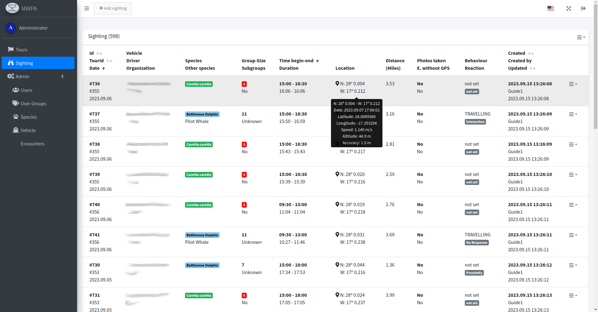
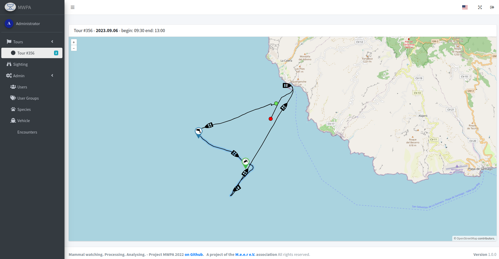

<p align="center">
  <a href="https://m-e-e-r.de/">
    
  </a>
</p>

<h1 align="center">
  MWPA
  <br />
  <sub><em>Mammal Watching. Processing. Analysing.</em></sub>
</h1>

<p align="center">
  Open-source platform for opportunistic cetacean observation:
  a <strong>mobile app</strong> for on-board recording, a
  <strong>web frontend</strong> for review &amp; analysis, and a
  <strong>backend</strong> built around the scientific workflow of
  <a href="https://m-e-e-r.de/">M.E.E.R. e.V.</a> off La&nbsp;Gomera.
</p>

<p align="center">
  <a href="https://www.gnu.org/licenses/gpl-3.0">
    
  </a>
  <a href="https://nodejs.org/">
    
  </a>
  <a href="https://www.typescriptlang.org/">
    
  </a>
  <a href="https://mariadb.org/">
    
  </a>
  <a href="https://gitter.im/Mammals-watchig-process-analyse/Main">
    
  </a>
  <a href="https://liberapay.com/StefanWerf/donate">
    
  </a>
</p>

<p align="center">
  <strong>User manual:</strong>
  <a href="doc/user-manual.en.md">EN</a>
  ·
  <a href="doc/user-manual.de.md">DE</a>
  ·
  <a href="doc/user-manual.es.md">ES</a>
  &nbsp;|&nbsp;
  <strong>Data guide:</strong>
  <a href="doc/data-collection.en.md">EN</a>
  ·
  <a href="doc/data-collection.de.md">DE</a>
  ·
  <a href="doc/data-collection.es.md">ES</a>
  &nbsp;|&nbsp;
  <a href="https://github.com/M-E-E-R-e-V/mwpa/wiki">Wiki</a>
  ·
  <a href="https://swe.stoplight.io/docs/mwpa/">API docs</a>
</p>

---

<p align="center">
  
  
</p>

## Contents

- [What MWPA does](#what-mwpa-does)
- [Quick start](#quick-start)
- [Architecture](#architecture)
- [Features](#features)
- [Tech stack](#tech-stack)
- [Data &amp; scientific use](#data--scientific-use)
- [Documentation](#documentation)
- [Project status](#project-status)
- [Contributing &amp; community](#contributing--community)
- [Citing MWPA](#citing-mwpa)
- [Supervisors](#supervisors)
- [License](#license)

## What MWPA does

> Whale- and dolphin-watching tours generate huge amounts of valuable observation data. Most of it used to disappear in paper logbooks or a sprawling Access database. MWPA brings that data into one place so it can be reviewed, exported, and analysed.

The platform sits on top of the long-running research programme of [M.E.E.R. e.V.](https://m-e-e-r.de/) (Marine Education, Environment, Research e.V.) for cetacean monitoring off La Gomera (Canary Islands, Spain).

**Three audiences, one dataset:**

- **Observers on board** record sightings (species, group size, behaviour, photos, GPS track) on the mobile app — even without network.
- **Reviewers in the office** verify, correct and complete records via the web frontend.
- **Researchers / authorities** export curated subsets for analysis or as regulatory deliverables (e.g. AROC).

## Quick start

> Prerequisites: Node.js 18+, npm, Docker (for MariaDB).

```bash
# 1. Clone with submodules (the in-house bambooo widget library is one)
git clone --recurse-submodules https://github.com/stefanwerfling/mwpa.git
cd mwpa

# 2. Bring up the database
docker compose up -d mariadb

# 3. Install everything (npm workspaces)
npm install

# 4. Build: schemas -> backend -> frontend
npm run compile

# 5. Start the backend (binds https://localhost:3000 with a self-signed cert)
node backend/dist/main.js --config=config.dev.json
```

Open the web app at <https://localhost:3000> (accept the self-signed certificate). The mobile app lives in a [separate repository](https://github.com/M-E-E-R-e-V/mwpa-app).

For deployment, configuration, the IM2020 legacy importer and the AROC report workflow see the [project wiki](https://github.com/M-E-E-R-e-V/mwpa/wiki).

## Architecture

```text
┌──────────────────────┐   sync     ┌──────────────────────┐
│  Mobile App (Flutter)│ ─────────► │                      │
│  offline-first       │            │                      │
└──────────────────────┘            │  Express + figtree   │
                                    │  (TypeScript)        │
┌──────────────────────┐   REST     │                      │
│  Web Frontend (SPA)  │ ◄────────► │  /json/*  /mobile/*  │
│  AdminLTE + bambooo  │            │                      │
└──────────────────────┘            └──────────┬───────────┘
                                               │ TypeORM
                                               ▼
                                    ┌──────────────────────┐
                                    │       MariaDB        │
                                    │  observations, tracks│
                                    │  derived analytics   │
                                    └──────────────────────┘
                                               ▲
                                               │ enrich
                                    ┌──────────┴───────────┐
                                    │ Background services  │
                                    │ depth · weather ·    │
                                    │ movement analytics   │
                                    └──────────────────────┘
```

The repo is an **npm workspaces monorepo** with three packages that build in order:

| Package | Role |
|---|---|
| [`schemas/`](schemas/) | Runtime types &amp; validators (using `vts`), generated from `schemas/schemas.json` via [vtseditor](https://github.com/stefanwerfling/vtseditor). Shared by backend &amp; frontend. |
| [`backend/`](backend/) | Node.js Express app on the [`figtree`](https://github.com/stefanwerfling/figtree) framework — services, repositories, REST routes. |
| [`frontend/`](frontend/) | Browser SPA — webpack bundle, AdminLTE 3 + jQuery + Bootstrap 4 + the in-house [`bambooo`](https://github.com/stefanwerfling/bambooo) widget library. |

## Features

### For observers (mobile)

- Offline-first sighting recording — species, group size, behaviour, photos
- Continuous GPS tracking during the tour
- Background sync once a network is available

### For reviewers (web)

- Sighting list with multi-column sort, in-header search, infinite scroll
- Map view with sighting markers + computed movement tracks (toggleable layer)
- Dashboard with crossfilter (date, species, organisation, vehicle, driver)
- Per-sighting analytics, year-on-year comparison, behavioural summaries
- Edit modal with photo gallery and validation against the shared schema

### For administrators

- Users, groups &amp; roles (RBAC via `rbac-simple`)
- Vehicles, drivers, organisations, species &amp; species groups
- Encounter categories, behavioural states, external receivers (AROC)
- Bulk re-derivation of analytics (e.g. movement tracks)

### For researchers

- Excel export with column picker &amp; coordinate-format selector (decimal / DMS / DM / all) — includes an Info sheet documenting the active filter
- AROC office-report export (filled `PLANTILLA_AVISTAMIENTOS_AROC.xlsx`, one file per boat per half-year)
- Printable Data Page (Map + Analytics + Year comparison) via the browser's PDF export
- Derived **movement tracks** per sighting: distance, speed, heading, turning-angle, with GPS-jump flag
- **Effort-only tours** — legs without sightings are still preserved server-side from the uploaded GPS track, so they appear in sighting-rate and survey-effort analyses

## Tech stack

| Layer | Technology |
|---|---|
| Language | TypeScript (`NodeNext` ESM in backend, webpack bundle in frontend) |
| Backend framework | [figtree](https://github.com/stefanwerfling/figtree) (Express + service-manager + DBRepository + RouteLoader) |
| ORM | TypeORM on MariaDB |
| Schema validation | [vts](https://github.com/stefanwerfling/vts) generated from JSON via [vtseditor](https://github.com/stefanwerfling/vtseditor) |
| Auth | Express session + custom RBAC (`mwpa_schemas` rights) |
| Frontend UI | AdminLTE 3, jQuery, Bootstrap 4, [bambooo](https://github.com/stefanwerfling/bambooo) widgets |
| Maps | OpenLayers + `ol-layerswitcher`, OSM tile cache |
| Analytics | d3 + dc.js (crossfilter), in-page charts and dashboards |
| Office exports | `node-xlsx` (sightings list), `JSZip` direct-XML patch (AROC template) |
| Mobile | Flutter ([separate repo](https://github.com/M-E-E-R-e-V/mwpa-app)) |
| Local infra | Docker Compose (MariaDB) |

## Data &amp; scientific use

A separate guide describes **how data is collected**, **what every field means**, **how the derived movement tracks are computed**, and **how to use the dataset for scientific analysis** — including a reproducibility checklist and an honest list of limitations.

- [English](doc/data-collection.en.md) — *Data collection &amp; scientific use*
- [Deutsch](doc/data-collection.de.md) — *Datenerhebung &amp; wissenschaftliche Nutzung*
- [Español](doc/data-collection.es.md) — *Recogida de datos y uso científico*

Topics covered:

1. Data sources (mobile app, web frontend, importers, background services)
2. Domain model — tour ▸ sighting ▸ tracking ▸ extended ▸ movement
3. Field-by-field reference
4. Coordinate &amp; time conventions (WGS84 / UTC / local-time caveats)
5. Derived movement tracks &amp; quality flags
6. Recommended analyses &amp; their limitations
7. Reproducibility checklist
8. Citation guidance

## Documentation

| Resource | What's inside |
|---|---|
| User manual — [EN](doc/user-manual.en.md) · [DE](doc/user-manual.de.md) · [ES](doc/user-manual.es.md) | Page-by-page walkthrough of the web frontend with screenshots |
| Data &amp; scientific use — [EN](doc/data-collection.en.md) · [DE](doc/data-collection.de.md) · [ES](doc/data-collection.es.md) | Field reference, derived analytics, reproducibility checklist |
| [Project wiki](https://github.com/M-E-E-R-e-V/mwpa/wiki) | Installation, deployment, IM2020 importer, AROC workflow |
| [REST API](https://swe.stoplight.io/docs/mwpa/) | Full endpoint reference (Stoplight) |
| [Database schema](https://dbdiagram.io/d/5dfa98f1edf08a25543f3bcc) | ER diagram of all entities |
| [CLAUDE.md](CLAUDE.md) | Developer onboarding (used by Claude Code &amp; humans) |

## Project status

- **Active** — under continuous development. See [issues](https://github.com/stefanwerfling/mwpa/issues) for the current backlog.
- **Backend migration** — the backend is being ported from `old-backend/` (legacy routing-controllers) to `backend/` (figtree framework). Most main and mobile resources are ported; see `old-backend/` only for unported logic that needs to move over.
- **Test suite** — *not yet*. Contributions welcome.

The mobile app (Flutter) is in production with M.E.E.R. e.V., so any change touching `/mobile/*` REST endpoints must keep the wire format backward-compatible.

## Contributing &amp; community

You're welcome to:

- File issues / feature requests on [GitHub](https://github.com/stefanwerfling/mwpa/issues)
- Send pull requests — please follow the existing ESLint rules (4 spaces, single quotes, strict TS) and the [CLAUDE.md](CLAUDE.md) conventions for schemas, routes and migrations
- Chat on [Gitter](https://gitter.im/Mammals-watchig-process-analyse/Main)
- Support the underlying NGO at [M.E.E.R. e.V.](https://m-e-e-r.de/) (donations, membership, on-site volunteering)
- Sponsor development:
  [Buy me a coffee](https://www.buymeacoffee.com/mwpa) ·
  [Liberapay](https://liberapay.com/StefanWerf/donate)

<table>
  <tr>
    <td align="center" valign="top" width="33%">
      <a href="https://m-e-e-r.de/">
        <br />
        <sub><b>Scientific partner</b></sub>
      </a>
    </td>
    <td valign="middle">
      <em>"Working with the people was wonderful and important."</em><br />
      MWPA exists because of the volunteers of M.E.E.R. e.V., who collect this data
      under real-world conditions tour after tour. Please support their work.
    </td>
  </tr>
</table>

## Citing MWPA

If you publish work based on data from this system, please:

1. **Acknowledge M.E.E.R. e.V.** as the data provider — [m-e-e-r.de](https://m-e-e-r.de/).
2. Cite the **collection period** (start / end date of the included sightings), not the tool version.
3. Contact M.E.E.R. e.V. for a project-specific data-use agreement before publication.

See the [data &amp; scientific use guide](doc/data-collection.en.md#citing-the-dataset) for the recommended attribution wording and the reproducibility checklist.

## Supervisors

- Christina Sommer — [M.E.E.R. e.V.](https://m-e-e-r.de/)
- Stefan Werfling — [Pegenau GmbH &amp; Co. KG](https://www.pegenau.de/)

## License

[](https://www.gnu.org/licenses/gpl-3.0)

This project is licensed under the GNU General Public License v3.0. See the [LICENSE](LICENSE) file for the full text.