# MWPA — Manual de usuario

  

Esta guía recorre el frontend web de MWPA página por página.
Para el modelo de datos, el significado de cada campo y el uso
científico del conjunto de datos consulta
[Recogida de datos y uso científico](data-collection.es.md).

> Idiomas: [English](user-manual.en.md) · [Deutsch](user-manual.de.md) · **Español**

## Contenido

1. [Inicio de sesión](#1-inicio-de-sesión)
2. [Navegación](#2-navegación)
3. [Lista de avistamientos](#3-lista-de-avistamientos)
4. [Salidas](#4-salidas)
5. [Salidas externas](#5-salidas-externas)
6. [Mapa Ocean & Fishing](#6-mapa-ocean--fishing)
7. [Mapa AIS en vivo](#7-mapa-ais-en-vivo)
8. [Terremotos y análisis de impacto](#8-terremotos-y-análisis-de-impacto)
9. [Admin → Usuarios](#9-admin--usuarios)
10. [Admin → Grupos de usuarios](#10-admin--grupos-de-usuarios)
11. [Admin → Roles](#11-admin--roles)
12. [Admin → Organización](#12-admin--organización)
13. [Admin → Especies](#13-admin--especies)
14. [Admin → Embarcación](#14-admin--embarcación)
15. [Admin → Encuentros](#15-admin--encuentros)
16. [Admin → Dispositivos](#16-admin--dispositivos)
17. [Salidas → Tracks huérfanos](#17-salidas--tracks-huérfanos)
18. [Admin → Fuentes externas de salidas](#18-admin--fuentes-externas-de-salidas)
19. [Admin → Servicios](#19-admin--servicios)

---

## 1. Inicio de sesión

Abre la aplicación web en tu navegador (por defecto
`https://localhost:3000/`) e inicia sesión con tu correo electrónico y
contraseña. La cuenta de administrador que viene con una instalación
nueva es:

| Campo      | Valor                |
|------------|----------------------|
| Correo     | `admin@mwpa.org`     |
| Contraseña | `changeMyPassword`   |

> **Cambia esta contraseña inmediatamente después del primer inicio de sesión.**

  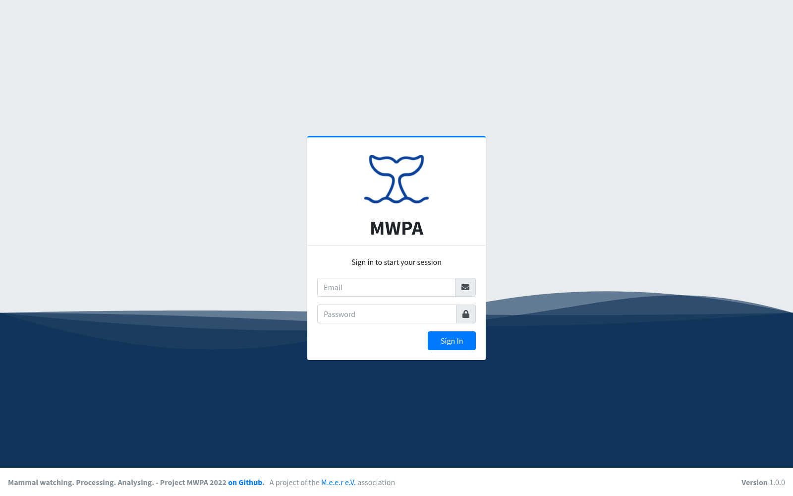

Tras iniciar sesión correctamente aterrizas en la lista de **Avistamientos**.

---

## 2. Navegación

La interfaz sigue el diseño AdminLTE:

- **Barra lateral izquierda** — navegación principal. Los grupos de primer nivel (p. ej. *Tours*, *Admin*) se despliegan al hacer clic.
- **Barra superior (derecha)** — selector de idioma (EN / DE / ES), pantalla completa, cerrar sesión.
- **Panel de usuario** en la barra lateral — usuario actual; un clic abre el perfil.
- **Pie de página** — número de versión y enlace al proyecto en GitHub.

El botón (≡) junto al título de la página colapsa la barra lateral a
modo solo-iconos para liberar espacio en pantallas pequeñas.

---

## 3. Lista de avistamientos

Página de inicio por defecto. Cada observación registrada durante una
salida aparece como una fila.

  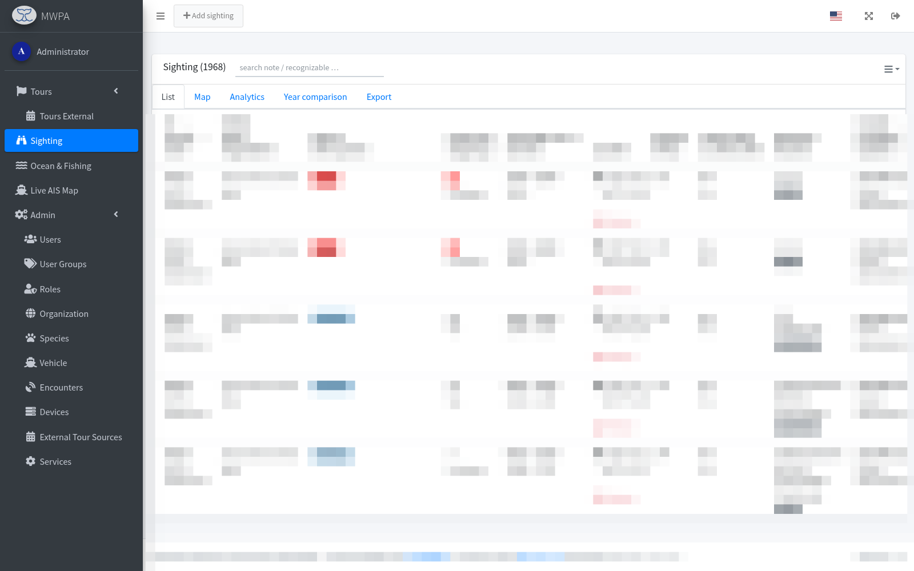

Las columnas incluyen id de salida, fecha, embarcación / organización,
especie, tamaño de grupo, duración, posición, comportamiento y reacción.
Las pestañas sobre la tabla cambian entre:

- **List** — vista tabular (mostrada arriba), ordenable por columna y con búsqueda en cada cabecera.
- **Map** — marcadores de avistamientos sobre el mapa más las trayectorias derivadas.
- **Analytics** — panel crossfilter (fecha, especie, embarcación, patrón, …).
- **Year comparison** — gráficos de distribución año a año.
- **Export** — exportación a Excel con selector de columnas y formato de coordenadas.

El botón **+ Add tour** crea una nueva salida (los avistamientos se
introducen normalmente desde la app móvil, pero el contenedor de salida
puede añadirse aquí).

El menú de acciones (☰) al final de cada fila abre el modal **Editar
avistamiento** con la lista completa de campos, galería de fotos y los
datos derivados de batimetría / meteorología.

---

## 4. Salidas

Cada fila es un viaje de un barco en un día — consulta el
[modelo de datos](data-collection.es.md#modelo-de-dominio).

  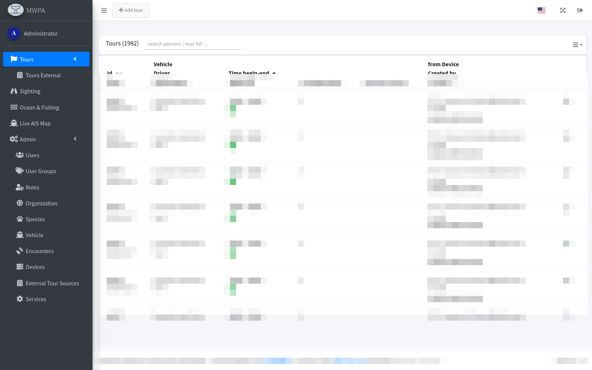

Columnas visibles: id de salida, fecha, embarcación + patrón,
hora de inicio / fin, número de avistamientos, número de puntos GPS,
personas a bordo, dispositivo origen y autor. **+ Add tour** crea una
entrada manual; el menú de acciones permite editar, eliminar o exportar.

---

## 5. Salidas externas

Subsección de *Tours* que lista los viajes importados de proveedores
externos (p. ej. FareHarbor). La tabla es como la de Salidas normales
pero con las columnas adicionales **Fuente externa** e **Id externo**.
Estas filas son de solo lectura respecto a la fuente; se puede asignar
una embarcación / patrón local para enriquecer el registro.

  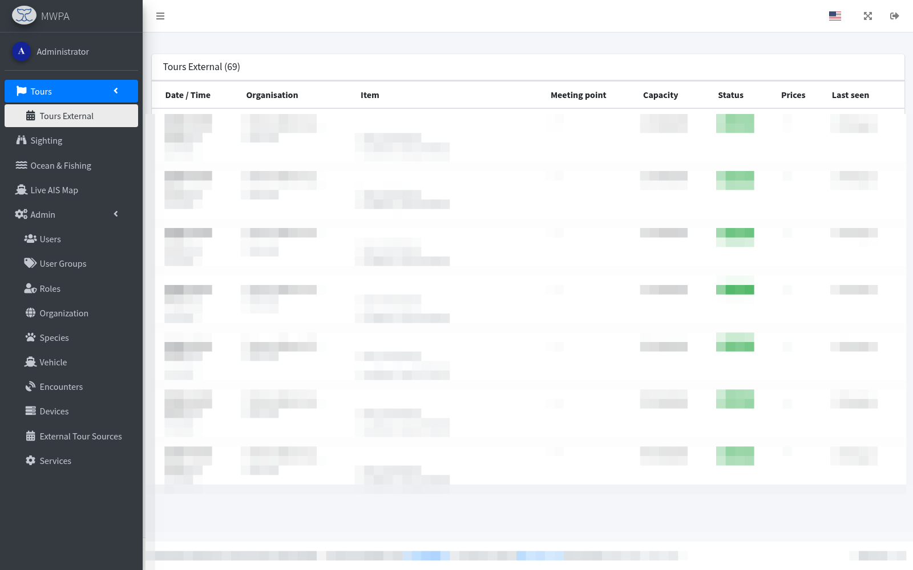

---

## 6. Mapa Ocean & Fishing

Muestra cada avistamiento sobre un mapa base de batimetría con capas
de salinidad superficial, clorofila-a, anomalía del nivel del mar y
corrientes superficiales (ERDDAP), además del esfuerzo pesquero de GFW.

  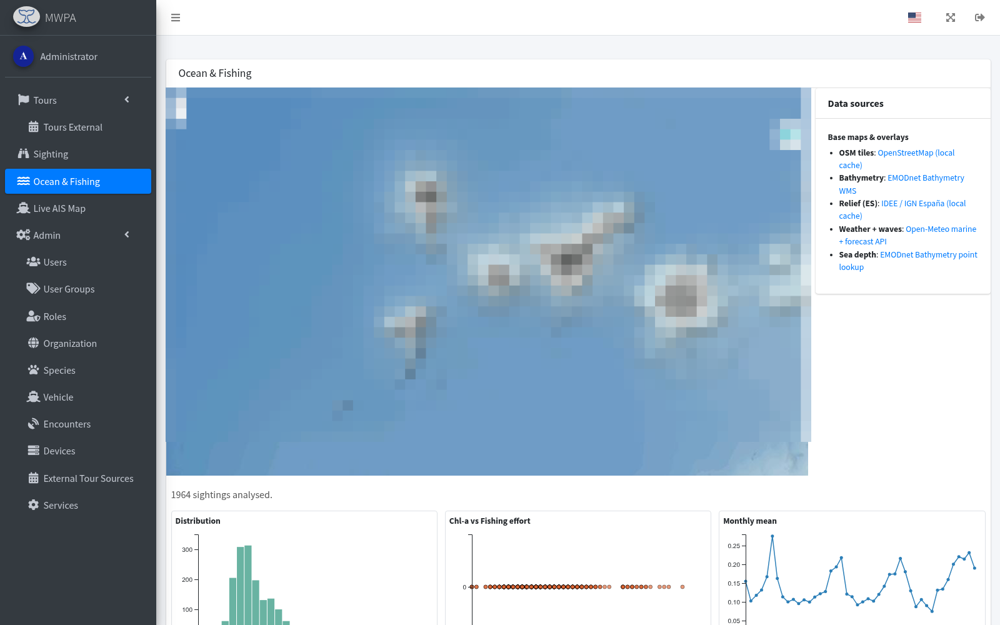

El panel **Data sources** a la derecha permite alternar mapas base y
superposiciones. La franja inferior muestra gráficos de distribución,
esfuerzo pesquero y media mensual para los avistamientos visibles.

---

## 7. Mapa AIS en vivo

Posiciones de embarcaciones en tiempo real desde AISStream.io sobre el
mismo mapa base. Haz clic en un marcador para abrir su rastro reciente.

  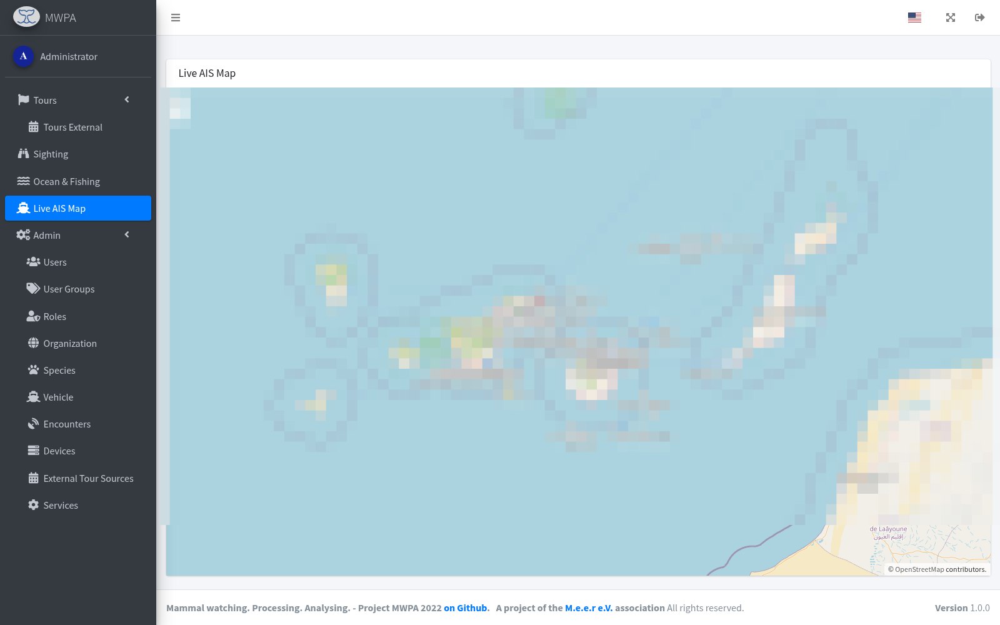

---

## 8. Terremotos y análisis de impacto

*Solo administrador.* Importa terremotos cada hora desde los catálogos
FDSNWS de **USGS** (cobertura global) y **EMSC** (reporte regional denso
para Canarias / Mediterráneo, hasta ~M 1,0) y los correlaciona con todos
los avistamientos dentro de ±14 días y 200 km.

**Tarjeta de filtros:**
- Periodo desde / hasta + magnitud mínima — llena la tabla de
  terremotos y los muestra como círculos en el mapa (radio según
  magnitud, tono según profundidad: superficial = rojo, profundo =
  ocre).
- **± ventana** — desplegable con cinco opciones:
  - *No mostrar avistamientos* (por defecto — solo lista de terremotos)
  - **±24 h** — respuesta aguda al estrés (varamientos, efectos de ondas P/S)
  - **±3 días** — cambio conductual a corto plazo
  - **±7 días** — desplazamiento / migración a medio plazo
  - **±14 días** — amplio, captura efectos retardados (ruidoso)

En cuanto se selecciona una ventana distinta de "ninguna", la página
carga el análisis de impacto sobre **todos** los terremotos de la tabla
actual:

- Los avistamientos afectados se renderizan como marcadores en el mapa
  (tooltip con especie, Δ km, Δ h)
- Por avistamiento se superpone el trayecto de movimiento calculado
  como polilínea
- Una tarjeta de **análisis** debajo del mapa muestra cuatro gráficos
  de barras: avistamientos por especie, por estado conductual, por
  categoría de encuentro, y un histograma de desfase temporal
  (horas con signo — positivo = terremoto antes del avistamiento)

**Sin botón de importación manual:** el cron horario trae los eventos
nuevos automáticamente. En el primer arranque de un proveedor el
relleno retroactivo arranca en la fecha del avistamiento más antiguo
menos 30 días.

**Recorrelacionar** (botón a la derecha de la barra de filtros):
recorre toda la tabla `earthquake` y reescribe las correlaciones
`sighting_seismic` — solo necesario tras un cambio en
`CORRELATION_RADIUS_KM` o `CORRELATION_WINDOW_DAYS` en el código.

---

## 9. Admin → Usuarios

Gestiona las cuentas de operador.

  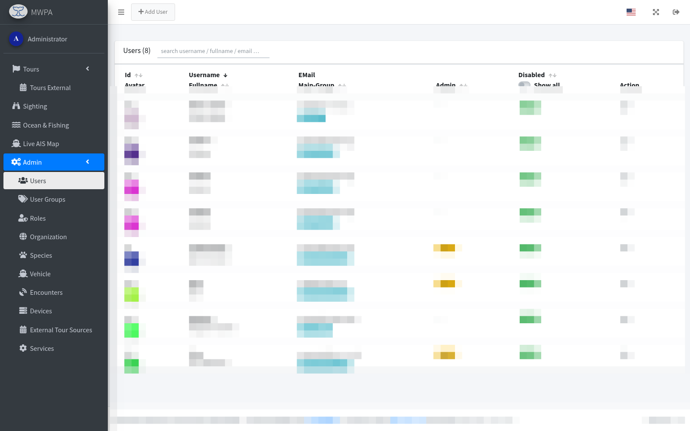

Cada usuario tiene id, nombre de usuario, nombre completo, correo,
grupo principal, indicador de admin y estado (*activo / deshabilitado*).
**+ Add User** abre el modal de edición, donde también se asignan
grupos secundarios y se restablecen contraseñas.

---

## 10. Admin → Grupos de usuarios

Los grupos asocian un *rol* (admin / importer / driver / guide …) con
una *organización*. Un usuario puede pertenecer a varios grupos pero
siempre tiene exactamente un *grupo principal*.

  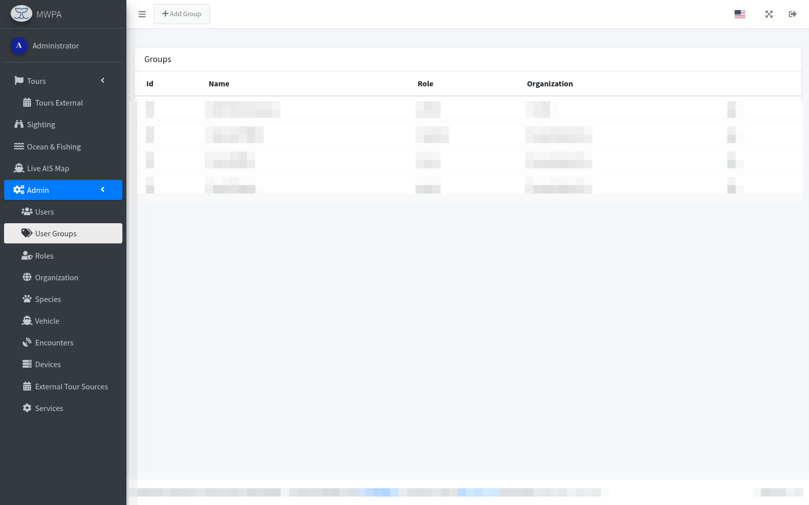

---

## 11. Admin → Roles

Los roles agrupan los permisos (RBAC) disponibles en el sistema. Los
nuevos permisos se añaden en
[`schemas/schemas.json`](../schemas/schemas.json) mediante el vtseditor;
no son texto libre.

  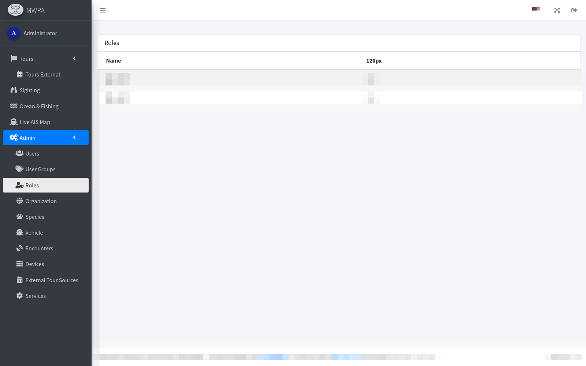

---

## 12. Admin → Organización

Entidad propietaria de embarcaciones, patrones, salidas y avistamientos.
Una sola instancia MWPA puede atender a varias organizaciones.

  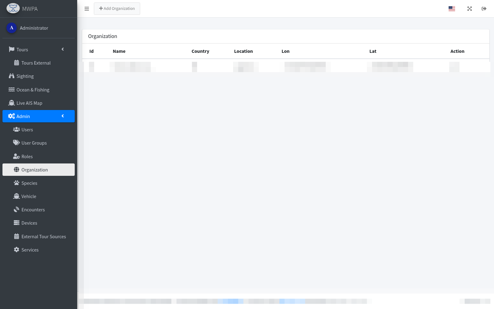

---

## 13. Admin → Especies

Lista maestra de cetáceos (y otros animales) entre los que el
observador puede elegir. Cada especie pertenece a un **grupo de
especies** (Odontoceti / Mysticeti / …) y puede llevar un **OTT id**
externo para enlazar con la taxonomía.

  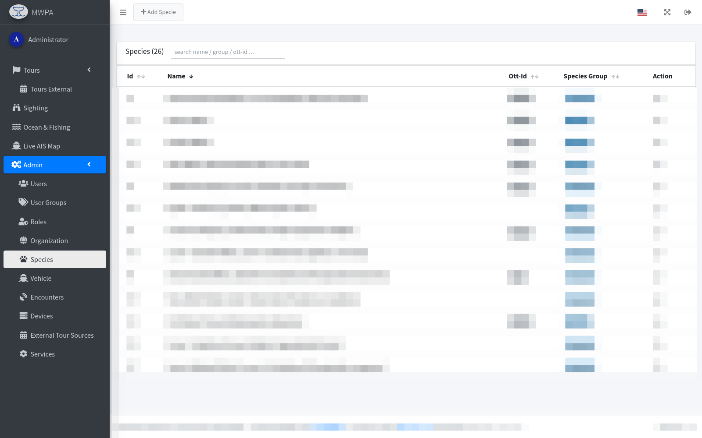

---

## 14. Admin → Embarcación

Las embarcaciones de la flota. Solo las entradas con **In use** = true
se ofrecen al crear una nueva salida.

  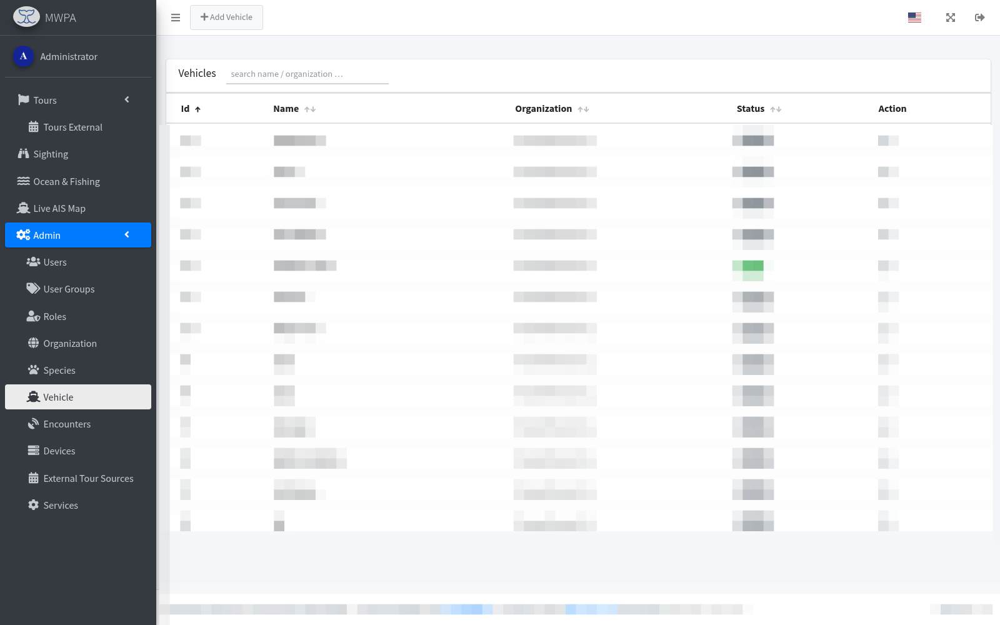

---

## 15. Admin → Encuentros

Categorías de encuentro utilizadas en el campo **Reacción** de un
avistamiento — *Interaction*, *No Response*, *Avoidance*, *Proximity*,
*Unknown*, etc.

  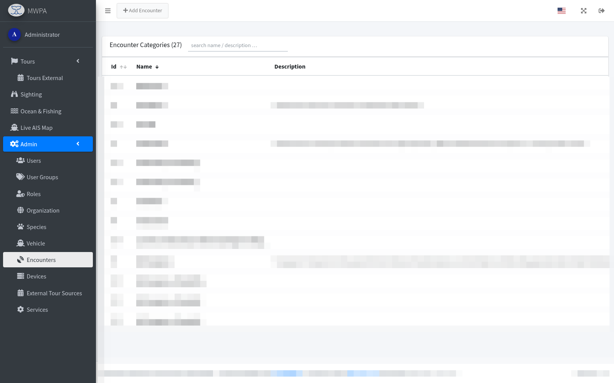

---

## 16. Admin → Dispositivos

Dispositivos móviles que se han sincronizado con el backend (una fila
por instalación). Útil para rastrear qué teléfono / tableta subió cada
salida.

  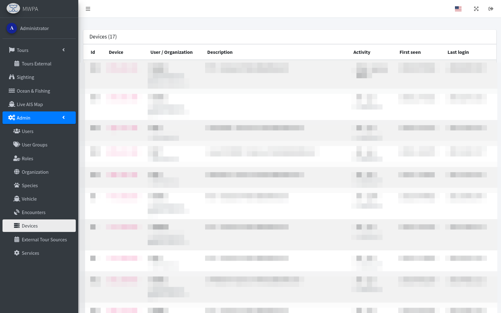

---

## 17. Salidas → Tracks huérfanos

*Solo administrador.* Disponible en el submenú **Salidas**. Lista los
buckets de tracking pendientes (`sighting_tour_tracking_pending`) que
no pudieron asignarse a ninguna `SightingTour` — algo típico cuando
tripulación o embarcación se corrigen en el portal después de la salida
y los puntos GPS quedan anclados al `tour_fid` antiguo.

  

**Modal de asignación:** al hacer clic en una fila se abre un diálogo
con cuatro selectores (embarcación, patrón, fecha, hora de inicio) y
una lista de coincidencias con las salidas candidatas. Debajo, una
pequeña **vista previa de mapa** del contenido del bucket (polilínea a
través de todas las posiciones decodificadas + marcadores de inicio /
fin + línea del intervalo temporal), de modo que se puede juzgar de un
vistazo si los datos pertenecen a una salida real o son solo ruido GPS.

- **Asignar** mueve las filas pendientes a `sighting_tour_tracking` del
  destino elegido y dispara un recálculo de `SightingMovement`.
- **Eliminar bucket** descarta las filas pendientes por completo — útil
  para pruebas, deriva en puerto o trazas GPS claramente rotas.

---

## 18. Admin → Fuentes externas de salidas

Configura proveedores externos (p. ej. FareHarbor) que alimentan la
lista de [Salidas externas](#5-salidas-externas). Cada fila guarda el
tipo de proveedor, las credenciales y un intervalo de sondeo.

  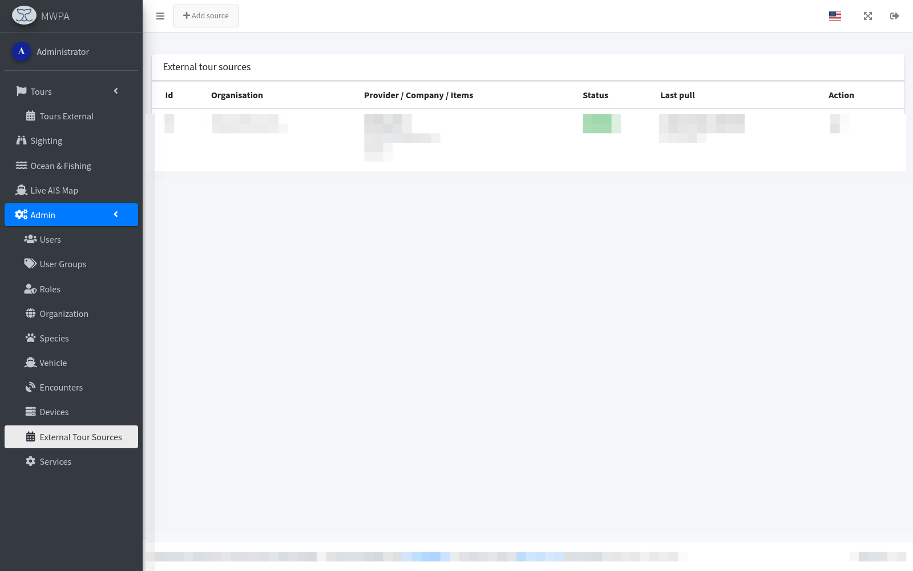

---

## 19. Admin → Servicios

Panel de estado del gestor de servicios del backend. Los **runners**
(p. ej. `mariadb`, `httpserver`) mantienen la plataforma en marcha; los
**schedulers** (`depth`, `weather`, `ocean`, `fishing-effort`,
`external-tour`, `live-ais`) refrescan los datos derivados según una
expresión cron.

  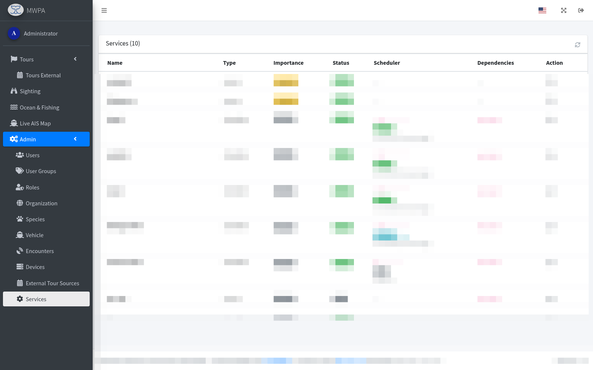

Desde el menú de acciones de cada fila se puede lanzar una ejecución
manual o inspeccionar el registro de la última ejecución.

---

## Más información

- [Recogida de datos y uso científico](data-collection.es.md) — qué significa cada campo y cómo usar las exportaciones para investigación.
- [Wiki del proyecto](https://github.com/M-E-E-R-e-V/mwpa/wiki) — instalación, despliegue, flujo AROC.
- [Referencia REST API](https://swe.stoplight.io/docs/mwpa/) — documentación completa de los endpoints.