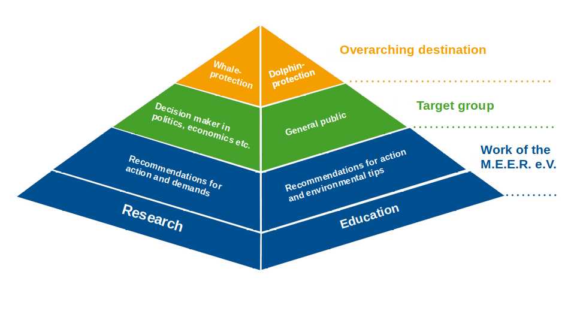
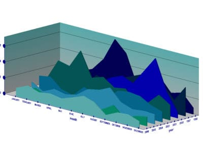
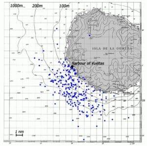

# Association

## The association

**We are very lucky to be able to work in one of the whale and dolphin the richest waters on the earth. This area urgently needs protection from excessive use or exploitation.**

<figure><figcaption>
M.E.E.R. e.V.
</figcaption></figure>

The purpose of the non-profit association is the promotion of environmental conservation, science and education, especially the protection of the cetaceans (whales and dolphins) and their marine habitats as well as cetacean research off La Gomera (Canary Islands). The award–winning project [_M.E.E.R._](https://m-e-e-r.de/en/) _La Gomera_ started in 1997. In 1998, the association itself was founded. With our work we want to contribute to the public awareness about the need for conservation of the oceans and its inhabitants, as well as fostering behavioural changes in humans to achieve better protection of the seas.

***

### Our central missions are…

<figure><figcaption>
Central missions show in a diagram.
</figcaption></figure>

* Research on dolphins and whales off La Gomera and humans impacts on them&#x20;
* Development of conservation concepts as a basis for action for decision makers&#x20;
* Raising public awareness of the threats of marine mammals&#x20;
* Development of strategies for effective marine conservation

***

## Sighting data

### Year round documentation

The sighting data is the basic information collected with every sighting of whales or dolphins. This includes:

<figure><figcaption></figcaption></figure>

* Date and time
* Start of sighting, duration and end of sighting
* Position (via GPS)
* Sea condition
* Sighted species
* Group size
* Presence of calves and / or juveniles
* Notes / specifics observations

During the whale watching trips off La Gomera, every sighting of whales and dolphins is documented on every single tour in the way outlined above. By using of special sighting data sheets developed by [M.E.E.R. e.V.](https://m-e-e-r.de/en/) and made available to the skippers, hundreds of sightings every year will be integrated into our sighting database.

### Extraordinary abundance of data

To date, the database encompasses several thousand data sets. With this data, it is possible to assess the abundance and distribution of cetaceans. Moreover, and on the basis of the abundance of data over the past years, trends can be recognized e.g. which species are sighted more or less often compared to the previous year, etc.

Thanks to our continuous documentation of all sightings, we accomplished that the sea Southwest to La Gomera is one of the most in-depth researched areas in the Canary Islands and in Europe.

<figure><figcaption></figcaption></figure>

The sighting data is published in papers for scientific journals, and is presented on international conferences, symposia and workshops.

### Publications

Research publications found under: [https://m-e-e-r.de/en/research/publications/](https://m-e-e-r.de/en/research/publications/)
