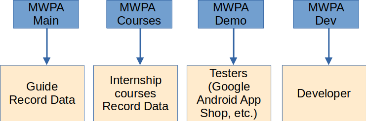

# Construction

<figure><figcaption></figcaption></figure>


This documentation is a technical overview!


## Two parts of MWPA

MWPA is divided into two parts.  The mobile app on your cell phone or tablet. And the server that collects the data.

<figure><figcaption>
Two parts of MWPA.
</figcaption></figure>

* MWPA - Server: [https://github.com/M-E-E-R-e-V/mwpa](https://github.com/M-E-E-R-e-V/mwpa)
* MWPA - App: [https://github.com/M-E-E-R-e-V/mwpa-app](https://github.com/M-E-E-R-e-V/mwpa-app)

<figure><figcaption>
Tablet for the MWPA App (Outdoor device).
</figcaption></figure>

***

## Sighting data flow

The data (sightings, tracking) is recorded on the boat using the app for the tablet. Back on site in the office (at home, etc.), the data is then transferred to the Internet (with WiFi) to the MWPA server (our MWPA Server hosting). On the server the data is collected, validated, analyzed, converted and can be exported.

<figure><figcaption>
Sighting data flow.
</figcaption></figure>

***

## MWPA Server structure

The sightings data and tracking data are sent to the backend via [HTTPS](https://de.wikipedia.org/wiki/Hypertext\_Transfer\_Protocol\_Secure) protocol. The backend saves this data in the database (images are stored in the file store). The backend takes care of the processing (collection, analysis, conversion and export creation). The frontend (web portal in the browser) can query data on the backend and trigger actions in the backend (exports, etc.)

<figure><figcaption>
Structure of MWPA server.
</figcaption></figure>

***

## Structure at M.E.E.R. e.V.

The structure at M.E.E.R. e.V. was set up as follows:

<figure><figcaption>
Server system on running MWPA server.
</figcaption></figure>

MWPA Server is installed in a container on a Virtual Environment ([Proxmox](https://www.proxmox.com/de/)). The container has its own private IP and can be accessed in the private network. The Virtual Environment can create a backup of the container every evening.&#x20;

The MWPA server is located in a [Docker](https://www.docker.com/) container in the container. Using an image of the MWPA server, one version can be quickly exchanged for a new version of the MWPA server.

To ensure that MWPA can be accessed securely from the Internet, it is released via [HTTPS](https://de.wikipedia.org/wiki/Hypertext\_Transfer\_Protocol\_Secure). This is done via [FlyingFish](https://flying-fish.gitbook.io/flyingfish/) (a proxy manager ([reverse proxy](https://de.wikipedia.org/wiki/Reverse\_Proxy)), another software that was developed, among other things, to solve problems for the MWPA software).

* FlyingFish: [https://github.com/stefanwerfling/flyingfish](https://github.com/stefanwerfling/flyingfish)

<figure><figcaption>
Server and network structure + Request way. 
</figcaption></figure>

The [FlyingFish](https://flying-fish.gitbook.io/flyingfish/) uses [LetsEncrypt](https://letsencrypt.org/de/) to issue a valid certificate, which can be used by the mobile app without any problems and allows the front end in the browser to run in a secure connection.

<figure><figcaption>
Certificate for HTTPS.
</figcaption></figure>

***

## Data verification

An important part of working with scientific data is the correctness of the data.

A data check is already carried out both during data recording (mobile device) and during data collection (backend). That the most important fields are set in order to be able to record a sighting.

<figure><figcaption>
Step 1 of Data verification.
</figcaption></figure>

According to this check, a sighting is already displayed as <mark style="background-color:yellow;">yellow</mark>/<mark style="background-color:red;">red</mark> in the mobile app. The person entering the data can immediately see and correct the error. This sighting is also immediately marked in red in the portal.

* <mark style="background-color:yellow;">**Yellow**</mark>: The sighting is missing data/incomplete, but the sighting is still running (the viewing end time has not yet been set).
* <mark style="background-color:red;">**Red**</mark>: The viewing has ended, the end of the viewing time has been set, but data is still missing.

<figure><figcaption>
Sighting with missing and incorrect data.
</figcaption></figure>

***

## Instances of MWPA at M.E.E.R. e.V.

M.E.E.R. e.V. has several instances of MWPA Server (backend and database) to record sightings:

* **Main**: In the main instance, the guides record the sightings which are later used for evaluation/exports etc.
* **Courses**: A separate database was created specifically for the [internship](https://m-e-e-r.de/delfine-erleben/praktikumskurse/). Participants can practice data collection here in parallel and later compare it with the main MWPA.
* **Demo**: This instance is used to check the app without the data from M.E.E.R. e.V. to release. This is an important part so that Google can test the app so that it can later publish the app in the app store.
* **Dev**: A version that is located locally on the developer's computer. This is where errors are checked, or new functions are implemented and tested.

<figure><figcaption>
M.E.E.R. e.V. MWPA instances.
</figcaption></figure>

***

## Team structure & Version Release

The development of the software is one of many projects at M.E.E.R e.V. Short, clear communication channels provide quick opportunities for action for requests for new functions or for reporting errors. The tasks are recorded in GitHub in a weekly meeting (with Tina and more and more Rolf) about requirements and problems.

<figure><figcaption>
Dev-Team.
</figcaption></figure>

If there is a problem on the boat, Rolf gets feedback from the guide (end user). Rolf (from Oceano) passes on problems and questions to Tina & Stefan. Tina and Stefan discuss the requirements/data and further development of MWPA. Inquiries from Fabian/M.E.E.R. team will also be discussed additionally (new requirements).

#### Tests of new versions:

Tina tests the new versions of MWPA and gives feedback on errors that are then corrected by Stefan. Then there is another test run. Once the errors have been fixed, the version can be released. The new version is then played on the tablet with Rolf. Innovations are then discussed together (user handling).
