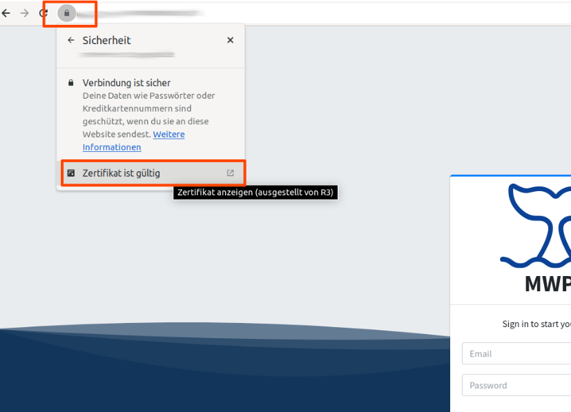

# Construction

<figure><figcaption></figcaption></figure>


This documentation is a technical overview!


## Two parts of MWPA

MWPA is divided into two parts.  The mobile app on your cell phone or tablet. And the server that collects the data.

<figure><figcaption>
Two parts of MWPA.
</figcaption></figure>

* MWPA - Server: [https://github.com/M-E-E-R-e-V/mwpa](https://github.com/M-E-E-R-e-V/mwpa)
* MWPA - App: [https://github.com/M-E-E-R-e-V/mwpa-app](https://github.com/M-E-E-R-e-V/mwpa-app)

## Sighting data flow

The data (sightings, tracking) is recorded on the boat using the app for the tablet. Back on site in the office (at home, etc.), the data is then transferred to the Internet (with WiFi) to the MWPA server (our MWPA Server hosting). On the server the data is collected, validated, analyzed, converted and can be exported.

<figure><figcaption>
Sighting data flow.
</figcaption></figure>

## MWPA Server structure

The sightings data and tracking data are sent to the backend via HTTPS protocol. The backend saves this data in the database (images are stored in the file store). The backend takes care of the processing (collection, analysis, conversion and export creation). The frontend (web portal in the browser) can query data on the backend and trigger actions in the backend (exports, etc.)

<figure><figcaption>
Structure of MWPA server.
</figcaption></figure>

## Structure at M.E.E.R. e.V.

The structure at M.E.E.R. e.V. was set up as follows:

<figure><figcaption>
Server system on running MWPA server.
</figcaption></figure>

MWPA Server is installed in a container on a Virtual Environment ([Proxmox](https://www.proxmox.com/de/)). The container has its own private IP and can be accessed in the private network. The Virtual Environment can create a backup of the container every evening.&#x20;

The MWPA server is located in a [Docker](https://www.docker.com/) container in the container. Using an image of the MWPA server, one version can be quickly exchanged for a new version of the MWPA server.

To ensure that MWPA can be accessed securely from the Internet, it is released via HTTPS. This is done via [FlyingFish](https://flying-fish.gitbook.io/flyingfish/) (a proxy manager, another software that was developed, among other things, to solve problems for the MWPA software).

<figure><figcaption>
Server and network structure + Request way. 
</figcaption></figure>

The [FlyingFish](https://flying-fish.gitbook.io/flyingfish/) uses [LetsEncrypt](https://letsencrypt.org/de/) to issue a valid certificate, which can be used by the mobile app without any problems and allows the front end in the browser to run in a secure connection.

<figure><figcaption>
Certificate for HTTPS.
</figcaption></figure>
