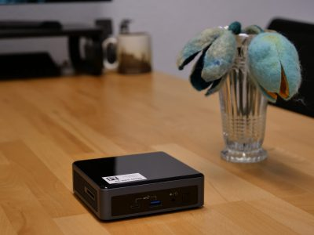

# My own Installation

## Connection and communication

First of all, I would recommend contacting [M.E.E.R. e.V.](https://m-e-e-r.de/) by email, we look forward to hearing from you!

You have two options:

1. You need the app to report your sightings to the government (e.g. in Spain)
2. You want to collect the data scientifically (university, research, etc.)


If you are 1st, it would of course be ideal if you do both and make your data available to the researchers!


## Completed installation

<figure><figcaption>
<a href="https://www.pegenau.de/">Pegenau GmbH &#x26; Co. KG</a>
</figcaption></figure>

You don't need any further technical knowledge for this. Hardware and installation can be buying. [Pegenau GmbH & Co. KG ](https://www.pegenau.de/)will also be selling you with a ready-made "[Mini-Serve](https://www.pegenau.de/miniserver/)r" with the software and take care of updates and support. Simply contact us for this.

<figure><figcaption>
Mini-Server, complete server system in a compact box.
</figcaption></figure>

## Open Source

The software is open source and can be found on GitHub. You are invited, take a look, create a fork and update the code. All we want is that the changes remain visible to all and remain open source. Only together can we create greater added value!

* [https://github.com/M-E-E-R-e-V/mwpa](https://github.com/M-E-E-R-e-V/mwpa-app)
* [https://github.com/M-E-E-R-e-V/mwpa-app](https://github.com/M-E-E-R-e-V/mwpa-app)

