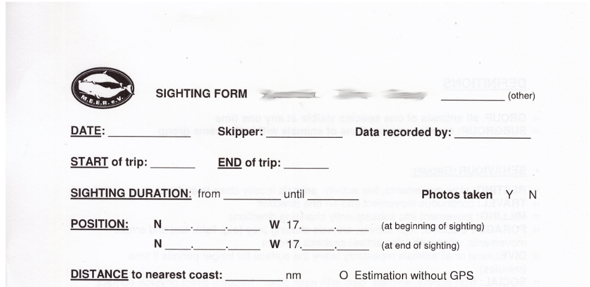
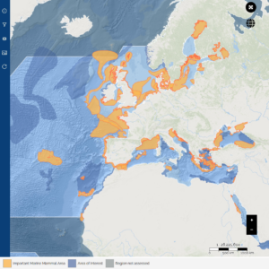

# Motivation & Project

## Motivation

When I started my trip with the M.E.E.R e.V. association, I got to know the scientific work on La Gomera. It was overwhelmed to get so close to the marine mammals (adventure). I recognized the value of this work. The association M.E.E.R e.V. has dedicated itself to the promotion of environmental protection, science and education, in particular the protection of the cetaceans (whales and dolphins) and their marine habitat as well as the research of the cetaceans off La Gomera (Canary Islands). Working with the people was wonderful and important. I was asked whether we could do something and because of the old software for collecting the data. After a long time passed by the pandemic, we finally got back to the topic. I would like to take on this task on a voluntary basis to the best of my ability and time.&#x20;

Signed Stefan

<figure><figcaption>
A picture of the island "La Gomera" from my photo collection while we are testing the sighting app (alpha version) on the boat tour.
</figcaption></figure>

<figure><figcaption>
A picture of a sighting from my photo collection while we are testing the sighting app (alpha version) on the boat tour.
</figcaption></figure>

## Project

As always, there is a situation that is unbearable and in which software can help. In the beginning there was the piece of paper and the pen....

Early or midday everyone gathered at the boat, some pieces of paper were pre-printed and ready for sighting dates.

<figure><figcaption>
Old sighting paper.
</figcaption></figure>

On the boat there is a lot of knowledge, printouts and a sighting in the middle of it all. From behind, the skipper called out the coordinates of the boat and the distance to the mainland. The behavior, species, young animals and so on were observed. Everything had to be written down on the piece of paper.

<figure><figcaption>
Fabian with old sighting paper.
</figcaption></figure>

At a much later point in time, the data was transferred to an Access database that was unfortunately already out of date. The font meant we had to puzzle too often and ask what this text meant.

<figure><figcaption>
Old access database formula.
</figcaption></figure>

But you can't blame that, because when the association started collecting data in (1998), our computers and cell phones weren't that advanced yet. The project has to start somewhere, and then you can expand something and see the direction of development.

### Digitalization

The goal has been clear to the club for a long time. The viewing data must be digitally recorded/converted and evaluated in an orderly manner.

[Christina (Tina) Sommer](https://m-e-e-r.de/en/association/team/) spoke to me again after a few years. And we started the project together. From Tina I received the specialist knowledge, feedback, and connection to the team and the people on the island.

<figure><figcaption>
Server login page.
</figcaption></figure>

<figure><figcaption>
Tablet with MWPA app.
</figcaption></figure>

## Goal

After all data has been collected, the data from M.E.E.R. e.V. evaluated in collaboration with other scientists. The result is then [publications/publications](https://m-e-e-r.de/en/research/publications/) and graphics.

<figure><figcaption>
<a href="https://m-e-e-r.de/en/milestone-for-meers-work-in-the-canaries/">https://m-e-e-r.de/en/milestone-for-meers-work-in-the-canaries/</a>
</figcaption></figure>

#### 2024-03-01 - IUCN REGARDS THE CANARY ISLANDS AS IMMA

The IUCN Marine Mammal Protected Areas Task Force recently announced the designation of 39 new Important Marine Mammal Areas (IMMAs) in the North-East Atlantic and the Baltic Sea. There are now 280 IMMAs worldwide. SEA. In May 2023, during an international workshop in Hamburg, he worked on the proposal to designate an IMMA for the entire Canary Islands, providing sighting data and geographical maps for La Gomera. We are delighted that this proposal has now been accepted! M.E.E.R.'s sightings database, one of the largest in the world, has undoubtedly helped to reinforce the importance of these waters to whales and dolphins. IMMAs represent important habitats for marine mammals. With the addition of new IMMAs to the IMMA e-Atlas, the portfolio of regions that require direct conservation measures based on verified data is growing. Scientists are calling on national and regional governments to use the IMMA database, for example to set up new protected areas and carry out environmental impact assessments.

<figure><figcaption>
IMMA e-Atlas
</figcaption></figure>

* Original article: [https://m-e-e-r.de/iucn-weist-die-kanarischen-inseln-als-imma/](https://m-e-e-r.de/iucn-weist-die-kanarischen-inseln-als-imma/)
* Working group documents and reports: [https://www.marinemammalhabitat.org/resources/documents/](https://www.marinemammalhabitat.org/resources/documents/)
* IMMA e-Atlas: [https://www.marinemammalhabitat.org/imma-eatlas/](https://www.marinemammalhabitat.org/imma-eatlas/)
