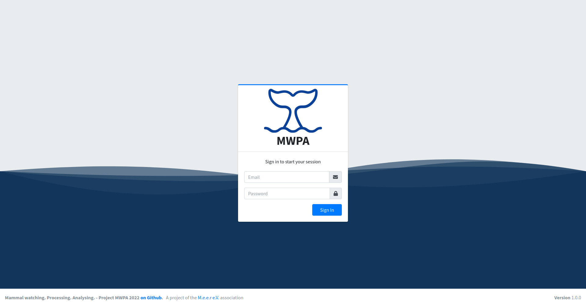

# User instructions


The software is still in development and some areas have not yet been completed.


<figure><figcaption>
Login page MWPA.
</figcaption></figure>

After logging into the site (frontend) you can navigate to the following areas:

<table data-view="cards"><thead><tr><th></th><th></th><th></th><th data-hidden data-card-target data-type="content-ref"></th></tr></thead><tbody><tr><td><strong>Sighting</strong></td><td>A list of sightings.</td><td></td><td><a href="sighting.md">sighting.md</a></td></tr><tr><td><strong>Tours</strong></td><td>A list of boat tours.</td><td></td><td><a href="tours.md">tours.md</a></td></tr><tr><td><strong>Admin</strong></td><td>Setting, select lists for the sightings.</td><td></td><td><a href="admin.md">admin.md</a></td></tr></tbody></table>
