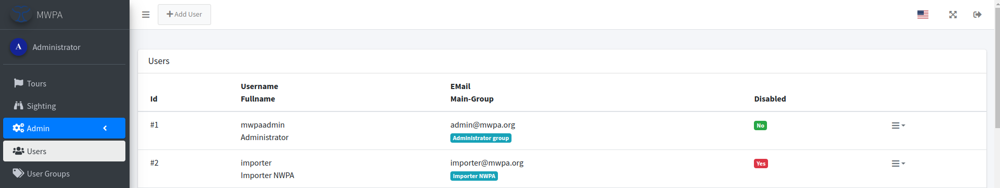
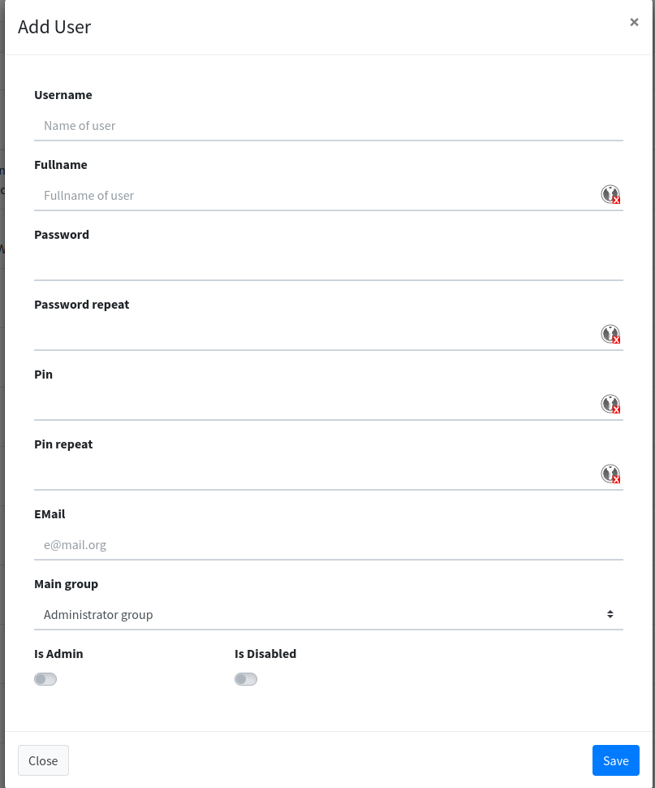

# Admin

## User-List

In the admin area you can maintain the users who can have access to the portal and mobile app.

<figure><figcaption>
User list.
</figcaption></figure>

### Add-/Edit-User

A user can be easily added or edited.

<figure><figcaption>
User Add-/Edit-Dialog.
</figcaption></figure>
