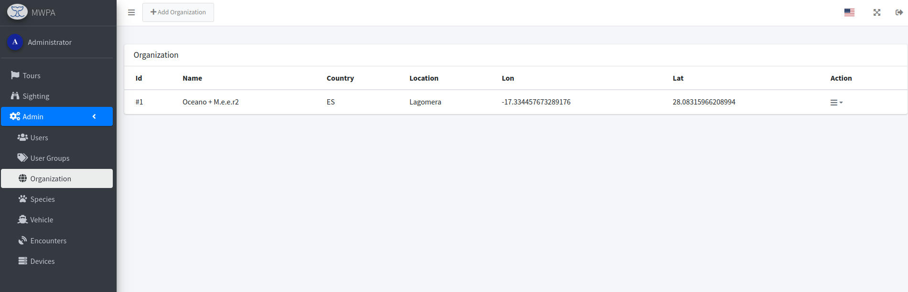

# Organization

## List

<figure><figcaption>
Organization List
</figcaption></figure>

Here the organizations (several locations in which the sightings are collected) can be created and managed.&#x20;

<figure><figcaption>
Action for an Organization
</figcaption></figure>

## Edit

The organization is created in this dialog with name, country and GPS information. This information centrally positions the OpenStreet maps.

<figure><figcaption>
Edit an Organization
</figcaption></figure>

## Tracking area

An area can be defined for each organization that defines “Home”. If the device moves out of this area, a [tour and tracking (GPS)](../tours.md) automatically starts. If you enter the area again, the tracking of the tour stops.

<figure><figcaption>
Edit dialog for Tracking-area "Home".
</figcaption></figure>
