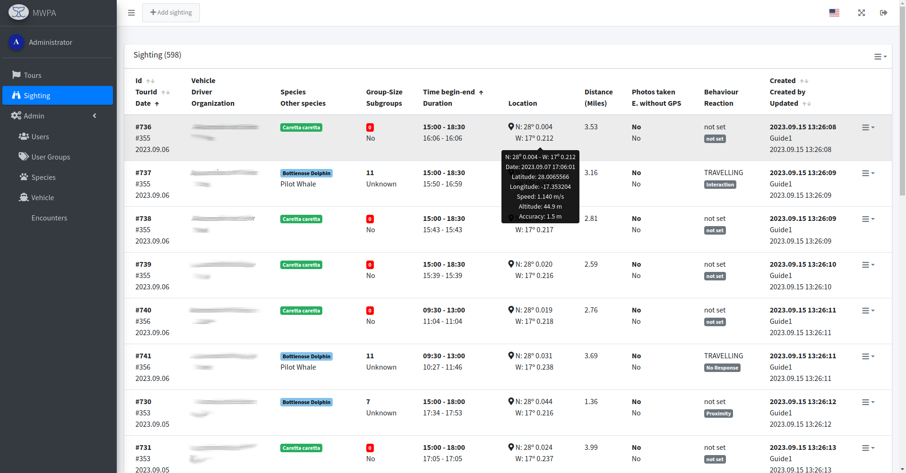
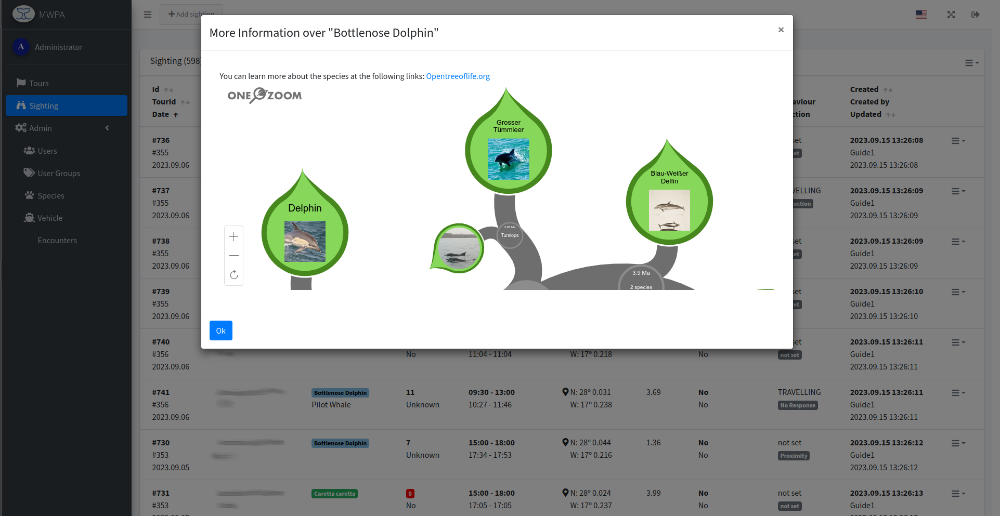
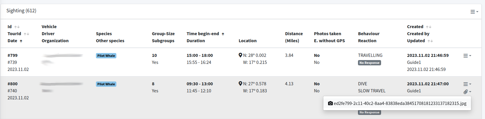
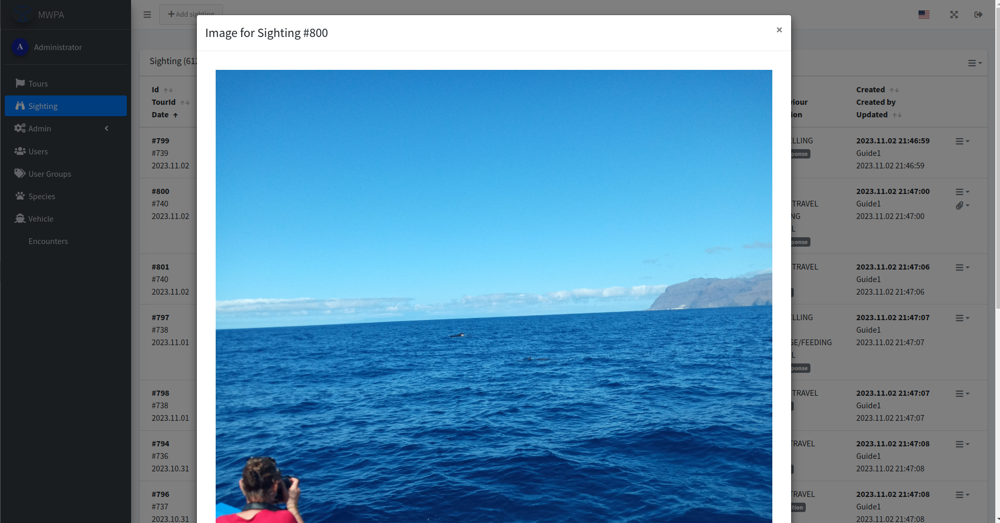
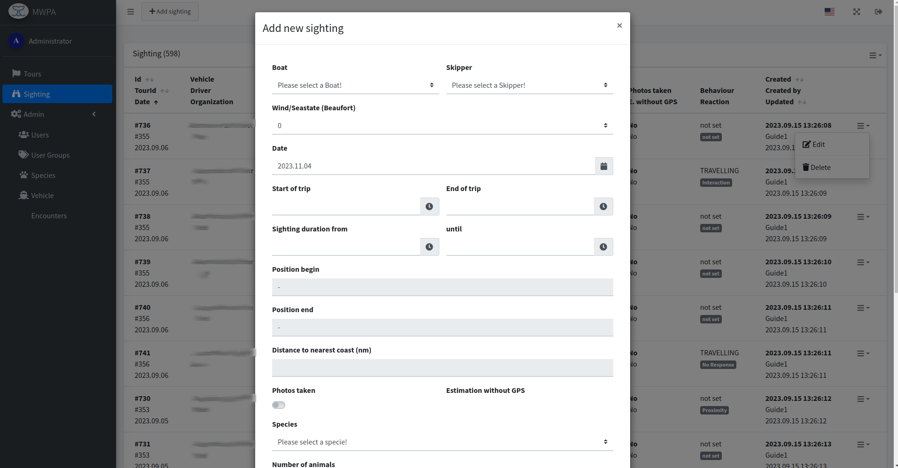

# Sighting

## The List

After logging in, you automatically end up on the sightings list. All synchronized sightings are displayed here, depending on the user's rights.

<figure><figcaption>
List of sightings.
</figcaption></figure>

The list provides a quick overview. By clicking on the species, further information appears.

<figure><figcaption>
Information to species with <a href="https://www.onezoom.org/">One-Zoom</a>.
</figcaption></figure>

By clicking on the GPS location you can quickly go to the [Tour-Map](tours.md#tour-map) and see the boat's journey.

An image of the sighting can also be transmitted from the mobile app.

<figure><figcaption>
Sighting (#800) with image.
</figcaption></figure>

The image can be viewed large and downloaded.

<figure><figcaption>
Image view from sighting.
</figcaption></figure>

## Add/Edit Sighting

Sightings can be corrected or added via the web interface.


Still in development.


<figure><figcaption>
Add-/Edit-Dialog sighting.
</figcaption></figure>

## Export

An Excel list for GIS or for a report to an authority can be downloaded via the list action menu.
