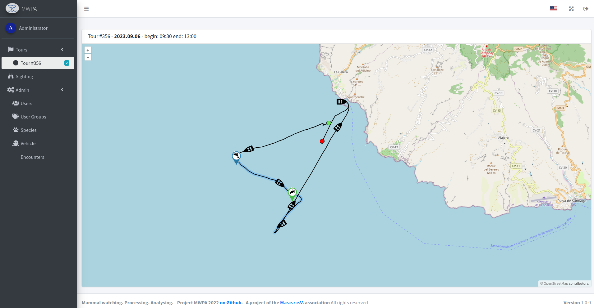

# Tours

## Tour List

In the list k all tours can be sorted by last seen date. The number of sightings can be seen and the number of tracking points.

<figure><figcaption>
List of tours with information.
</figcaption></figure>

By clicking on the tracking points you can switch to the tour map.

## Tour-Map

By following the tour, the “start” and “end” can be changed at any time and the corresponding coordinates can be set correctly again for a sighting. In addition, the route can be created on a map using tracking. The movement of the boat and the animals can be followed.

<figure><figcaption>
Map to tour tracking (Tour-ID: #356).
</figcaption></figure>

Additional information about the sighting is displayed with a click in a tooltip.

<figure><figcaption>
Sighting (#800) with image.
</figcaption></figure>

The resolution and [additional information](../construction.md#more-data-for-the-sightings), for example sea depth, are also displayed.

<figure><figcaption>
Sighting with Sperm whale and <a href="../construction.md#more-data-for-the-sightings">Sea depth</a> information.
</figcaption></figure>
